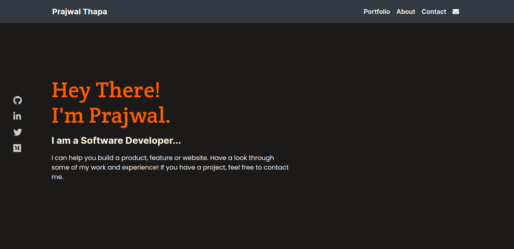

# Portfolio

> The is my personlized portfolio website which showcases my knowledge and skills. It contains a collection of my recent projects and also a list of languages and frameworks that I have knowledge of.

## Built With

- HTML 5 and CSS 3.
- Google Fonts.
- Fontawesome
- Bootstrap

## Live Demo

[Live Demo Link](https://praz99.github.io)

## Getting Started

Just fork it and you are good to go.

## Authors

👤 **Prajwal Thapa**

- Github: [praz99](https://github.com/praz99)
- Twitter: [@thapa_praz](https://twitter.com/thapa_praz)
- LinkedIn: [prazwal-thapa](https://linkedin.com/in/prazwal-thapa)
- Email: (t.prazwal@gmail.com)

## 🤝 Contributing

Contributions, issues and feature requests are welcome!

Feel free to check the [issues page](issues/).

## Show your support

Give a ⭐️ if you like this project!

## Acknowledgments

- The template for this portfolio has been taken from [Microverse Students Portfolio Templates](https://www.figma.com/file/WuGzuv1ivRRqilLK8o7Ddz/Microverse-Student-Potfolio-Templates-(Copy)?node-id=1%3A1471)

## 📝 License

This project is [MIT](./LICENSE) licensed.